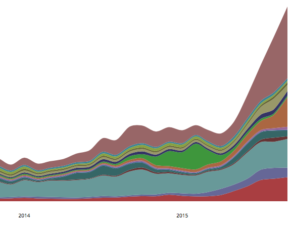
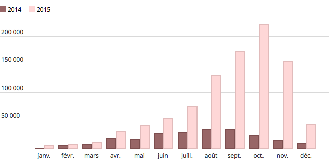
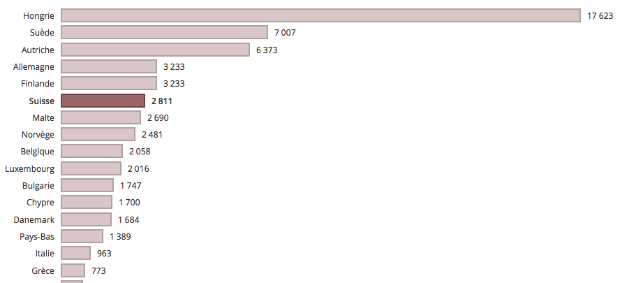

*Social Media proposals*
# 2015: la vague migratoire atteint l’Europe 

**TPT 18.2015 data story**

### General 

I would suggest for this 2015 retrospective data story to have a one tweet every 1 or 2 days from the publication date until the end of the year (so about 6 - 10 tweets). For Facebook, maybe less posts: 4-6

### Hashtags & mentions (for twitter)

Think to add the appropriate hashtags for this story on twitter.

Use at least one of these hashtags to tag it as a story about migrants/refugees: 
 
 * \#refugees, #migrant, #migrantcrisis, #asylum

Have at least one of these hashtags to tag it as data/graphics-driven story: 

* \#ddj, #dataviz

Furthermore on the 18th of December, it is the International migrants day. So you could also add this hashtag: 

* \#InternationalMigrantsDay

It would be a good idea to notify some of the data providers used for this story, we can do it by adding their twitter handle to the tweet. Maybe do this only once, we don’t want to spam people.

* @EU_eurostat (the main data provider used in this story)
* @refugees (UNCHR twitter)

## Tweet/FB post suggestions

### General one

> 2015 the year of the #migrationcrisis, check out our retrospective in graphics. #ddj #dataviz

### Ones to be used with an image

##### 1st graphic

Or as [a gif](http://g.recordit.co/5IT2bBrN7S.gif)

> About 1 million #asylum applications in Europe in 2015, here are their origins and destinations

> Switzerland received 3% of all #asylum applications in Europe in 2015, but only 1% of Syrian applications

##### 2nd graphic

> This is how the influx of monthly #asylum seekers in 2015 in Europe looks like

> A spike of 170,000+ #asylum applications in Sept 2015 in Europe. The breakdown by country of origin: 

#### 3rd graphic

> 900,000+ #migrants crossed the Mediterranean sea in 2015. On average, 10 per day died. #migrantcrisis

> 900,000+ #migrants crossed the Mediterranean sea in 2015, 4 times more than in 2014. 

##### 4th graphic

or as [a gif](http://recordit.co/VkytezzcsY)

> If Germany received the most #asylum applications in 2015 in Europe, Hungary got far more applications by capita.

> Switzerland is the 6th European country in #asylum applications by capita in 2015. It was 4th in 2014. 

> How do European countries compare with their number of #asylum applications received in 2015? Check this in our interactive graphic. 

